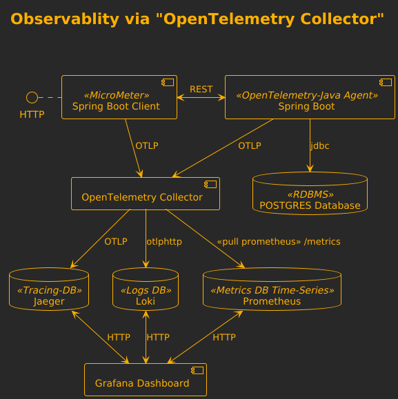
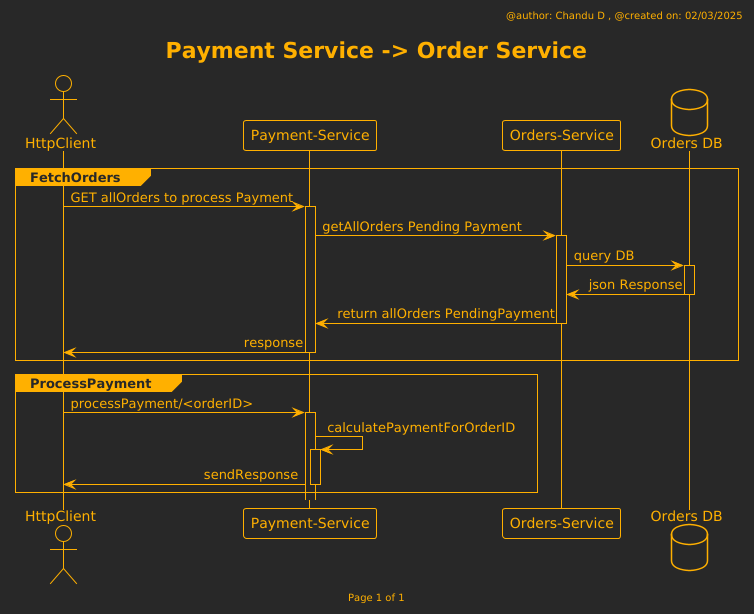

# Spring Boot observability via OpenTelemetry




## OpenTelemetry data pipeline

An Observability framework and toolkit designed to create and manage telemetry data such as traces, metrics, and logs.
Vendor and tool-agnostic, meaning that it can be used with a broad variety of Observability backends.

* Instrument your workloads to push (or offer) the telemetry data to a processing/collecting element -i.e. OpenTelemetry Collector-
* Configure OpenTelemetry Collector to receive or pull the data from diverse workloads
* Configure OpenTelemetry Collector to process the data -i.e adding special tags, filtering data-
* Configure OpenTelemetry Collector to push (or offer) the data to compatible backends
* Configure and use the backends to receive (or pull) the data from the collector, to allow analysis, alarms, AI ... pretty much any case that you can think about with data

### Setup 

Use Google Jib to create a Docker Image `order-service:0.0.5-SNAPSHOT` that you see in `docker-compose.yml` file.


1. To create `order-service:0.0.5-SNAPSHOT` by using `gradlew` with `Java 17`
```shell
mvn clean package jib:dockerBuild -DskipTests
```

2. Then, to spin up all the `docker-compose.yml`
```shell
docker compose up -d
```
### Steps to Execute the API requests



1. Send sample requests to `Order Service`
    
    ```shell 
    curl -X GET http://localhost:8080/orders/1
    ```
    ```shell 
    curl -X GET http://localhost:8080/orders/4
    ```
    ```shell 
    curl -X GET http://localhost:8080/orders/4
    ```
    ```shell 
    curl -X POST http://localhost:8080/orders \
         -H "Content-Type: application/json" \
         -d '{
               "id": 4,
               "customerId": 4,
               "orderDate": "2023-11-25T23:33:12.130+02:00",
               "totalAmount": 100.50
             }'
    ```
    ```shell 
    curl -X GET http://localhost:8080/orders/4
    ```
    ```shell 
    curl -X PATCH http://localhost:8080/orders/1 \
         -H "Content-Type: application/json" \
         -d '{
               "totalAmount": 120.75
             }'
    ```
    ```shell 
    curl -X GET http://localhost:8080/orders/1
    ```
    ```shell 
    curl -X DELETE http://localhost:8080/orders/4
    ```
2. Send sample requests to `Payment Service` on api: `getAllOrders`

    ```shell 
    curl -X GET http://localhost:8081/payments/getAllOrders
    ```
    
    * http request to process `payment-service` for <`OrderId`> . 
       
         * Low CPU test, execute the below curl for values from 1 to 10.
           ```shell
           curl -X GET http://localhost:8081/payments/processPayment/3
            ```
         * For High CPU test : don't go above `processPayment/45`
           ```shell
              curl -X GET http://localhost:8081/payments/processPayment/42
            ```

### Grafana

Access Grafana to observe metrics, traces, logs at ```  http://localhost:3000 ```
