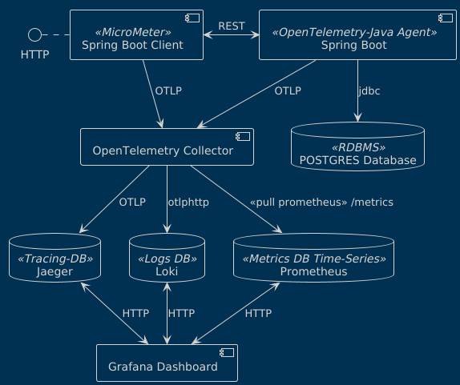

# Spring Boot observability via OpenTelemetry




## OpenTelemetry data pipeline

An Observability framework and toolkit designed to create and manage telemetry data such as traces, metrics, and logs.
Vendor and tool-agnostic, meaning that it can be used with a broad variety of Observability backends.

* Instrument your workloads to push (or offer) the telemetry data to a processing/collecting element -i.e. OpenTelemetry Collector-
* Configure OpenTelemetry Collector to receive or pull the data from diverse workloads
* Configure OpenTelemetry Collector to process the data -i.e adding special tags, filtering data-
* Configure OpenTelemetry Collector to push (or offer) the data to compatible backends
* Configure and use the backends to receive (or pull) the data from the collector, to allow analysis, alarms, AI ... pretty much any case that you can think about with data

### Setup 

Use Google Jib to create a Docker Image `order-service:0.0.5-SNAPSHOT` that you see in `docker-compose.yml` file.


1. To create `order-service:0.0.5-SNAPSHOT` by using `gradlew` with `Java 17`
```shell
./gradlew clean build jibDockerBuild -x test
```

2. Then, to spin up all the `docker-compose.yml`
```
docker compose up -d
```

3. Send sample requests to `Order Service`
```http request
GET http://localhost:8080/orders/1
GET http://localhost:8080/orders/2
GET http://localhost:8080/orders/3

curl -X POST http://localhost:8080/orders \
     -H "Content-Type: application/json" \
     -d '{
           "id": 4,
           "customer_id": 4,
           "order_date": "2023-11-25T23:33:12.130+02:00",
           "total_amount": 100.50
         }'
         
curl -X PATCH http://localhost:8080/orders/1 \
     -H "Content-Type: application/json" \
     -d '{
           "total_amount": 120.75
         }'

curl -X DELETE http://localhost:8080/orders/1

```

4. Access Grafana to observe metrics, traces, logs at
```
http://localhost:3000
```

---

#### Be aware at step 1, the `docker image` is created for ARM architecture (MAC M1)
#### If you're in linux, please change the following line in `build.gradle` file
```yaml
platforms {
    platform {
        architecture = 'arm64'
        os = 'linux'
    }
}
```
to
```yaml
platforms {
    platform {
        architecture = 'amd64'
        os = 'linux'
    }
}
```
then run
```shell
./gradlew clean build jibDockerBuild -x test
```

#### Maven Setup

```shell
 mvn clean package jib:dockerBuild -DskipTests
```
---